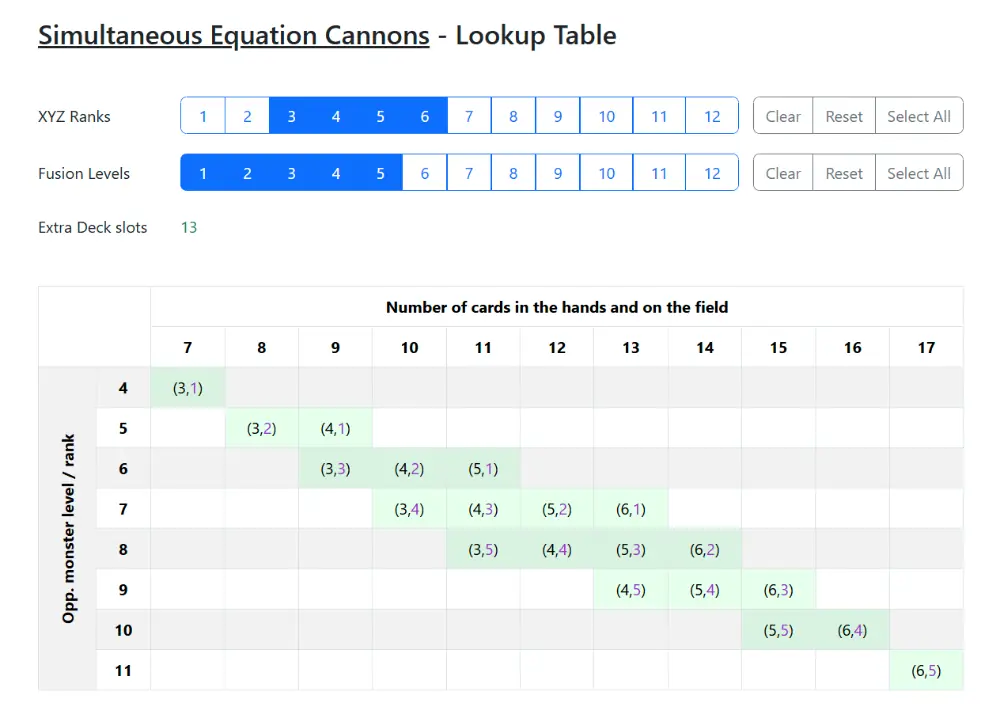

# Simultaneous Equation Cannons - Lookup Table

This web app simplifies the process of resolving the powerful additional effect of the Yu-Gi-Oh! card [**Simultaneous Equation Cannons**](https://www.db.yugioh-card.com/yugiohdb/card_search.action?ope=2&cid=19921). Input your available **Xyz Ranks** and **Fusion Levels** to generate a **lookup table** that highlights scenarios where you can use your Extra Deck cards to banish your opponent's field.

## 📜 Card Effect Breakdown

**Simultaneous Equation Cannons** requires solving the system of equations $x + y = c_1$ and $2x + y = c_2$ where:
- **x** = Rank(s) of the Xyz Monster(s) used
- **y** = Level of the Fusion Monster used
- **c₁** = Rank or Level of an opponent’s face-up monster
- **c₂** = Total number of cards in both players’ hands and on the field

The additional effect can only be applied when these equations have valid solutions using the Extra Deck monsters you have available.

## 🖥️ Live Version

You can access the web app through GitHub Pages:

  👉 <b><a href="https://atthakasem.github.io/SEC-LT/" target="_blank">Open the web app</a></b>

## 🚀 How to Use

1. **Select the Xyz Ranks and Fusion Levels** available in your Extra Deck.
2. **View the generated lookup table** to see possible resolutions of SEC's additional effect. Each tuple contains the required Xyz Rank and Fusion Level.

## 📂 Installation & Development

### Prerequisites

- Bun

### Steps

1. Clone the repository: `git clone https://github.com/atthakasem/SEC-LT.git && cd SEC-LT`
2. Install dependencies: `bun install`
3. Run the development server: `bun run dev`

## 📜 License

This project is licensed under the MIT License.
